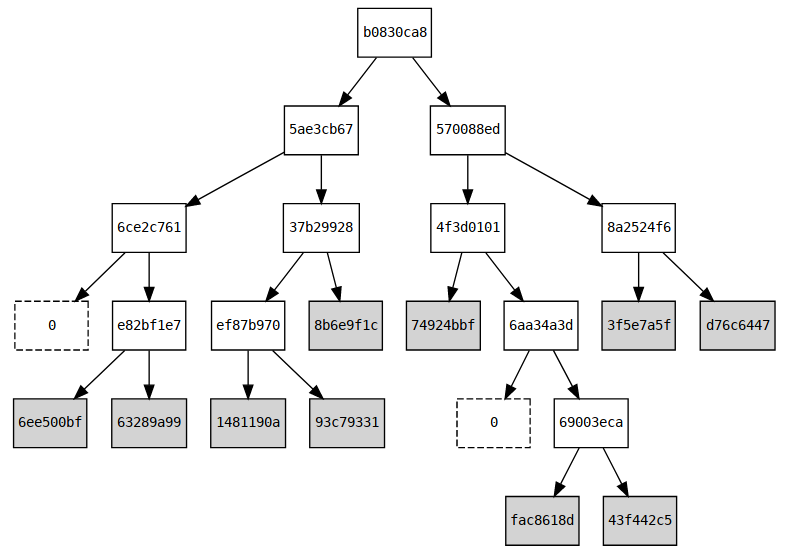

# Merkletree usage

## Import

Import packages:
```go
import (
  "github.com/iden3/go-iden3/db"
  "github.com/iden3/go-iden3/merkletree"
  "github.com/iden3/go-iden3/core"
  common3 "github.com/iden3/go-iden3/common"
)
```

## New Merkletree

Define new tree:
```go
// first we create the storage, where will be placed the leveldb database
storage, err := db.NewLevelDbStorage("./path", false)
if err!=nil {
  panic(err)
}
// new merkletree of 140 levels of maximum depth using the defined
// storage
mt, err := merkletree.NewMerkleTree(storage, 140)
if err!=nil {
  panic(err)
}
defer mt.Storage().Close()
```

## Add claims

To add claims, first we need to have a claim data struct that fits the
`Claim` interface:
```go
// Data consists of 4 elements of the mimc7 field.
type Data [4]ElemBytes
// An Entry contains Data where the claim will be serialized.
type Entry struct {
  Data Data
  [...]
}
// Claim is the interface of a generic claim.
type Claim interface {
  Entry() *Entry
}
```

We can use a new struct, or also use one of the already existing in the `go-iden3/core/claim.go`.

For this example, we will use the `core.ClaimAssignName`.
We add two different claims into the merkletree:
```go
name0 := "alice@iden3.io"
ethAddr0 := common.HexToAddress("0x7b471a1bdbd3b8ac98f3715507449f3a8e1f3b22")
claim0 := core.NewClaimAssignName(name0, ethAddr0)
claimEntry0 := claim0.Entry()

name1 := "bob@iden3.io"
ethAddr1 := common.HexToAddress("0x28f8267fb21e8ce0cdd9888a6e532764eb8d52dd")
claim1 := core.NewClaimAssignName(name1, ethAddr1)
claimEntry1 := claim1.Entry()
```
Once we have the `claim` struct that fits the `Claim` interface, we can add
it to the merkletree:
```go
err = mt.Add(claimEntry0)
if err != nil {
  panic(err)
}
err = mt.Add(claimEntry1)
if err != nil {
  panic(err)
}
```

## Generate merkle proof

Now we can generat the merkle proof of this claim:
```go
mp, err := mt.GenerateProof(claimEntry0.HIndex(), nil)
if err != nil {
  panic(err)
}

// We can display the merkleproof:
fmt.Println("merkle proof: ", mp)
// out: 
// merkle proof:  Proof:
//         existence: true
//         depth: 2
//         notempties: 01
//         siblings: 0 a045683a
```

### Generate merkle proof for a specific tree (with specific root)
```go
mp, err := mt.GenerateProof(claimEntry0.HIndex(), specificRoot)
if err != nil {
  panic(err)
}
```


## Check merkle proof

Now from a given merkle proof, we can check that it's data is consistent:
```go
checked := merkletree.VerifyProof(mt.RootKey(), mp,
				  claimEntry0.HIndex(), claimEntry0.HValue())
// checked == true
```

## Get value in position

We can also get the `claim` byte data in a certain position of the merkle tree
(determined by its Hash Index (`HIndex`)):
```go
claimDataInPos, err := mt.GetDataByIndex(claimEntry0.HIndex())
if err!=nil{
  panic(err)
}
```

## Proof of non existence

Also, we can generate a `Proof of non existence`, that is, the merkle proof
that a claim is not in the tree.
For example, we have this `claim2` that is not added in the merkletree:
```go
name2 := "eve@iden3.io"
ethAddr2 := common.HexToAddress("0x29a6a240e2d8f8bf39b5338b9664d414c5d793f4")
claim2 := core.NewClaimAssignName(name2, ethAddr2)
claimEntry2 := claim2.Entry()
```
Now, we can generate the merkle proof of the data in the position of this claim
in the merkletree, and print it to see that it's a non-existence proof:
```go
mp, err = mt.GenerateProof(claimEntry2.HIndex(), nil)
if err != nil {
  panic(err)
}

// We can display the merkleproof:
fmt.Println("merkle proof: ", mp)
// out: 
// merkle proof:  Proof:
//         existence: false
//         depth: 2
//         notempties: 01
//         siblings: 0 a045683a
//         node aux: hi: c641b925, ht: eeae8c7e
```
In the `mp` we have the merkleproof that in the position of this `claim2` (that
is determined by its Hash Index (`HIndex`)) there is no data stored (so, it's an
`NodeTypeEmpty` not actually stored in the tree).

We can check this proof by calling the `VerifyProof` function, and in the
parameter where we put the Hash Total (`HtTotal`) we can actually put anything,
because we can proof that anything is not there.  We will use the Hash Total of
the claim2 for convenience.
```go
checked = merkletree.VerifyProof(mt.RootKey(), mp, claimEntry2.HIndex(), claimEntry2.HValue())
// checked == true
```

## Live snapshot of the tree
This option allows to create a read only `snapshot` of the Merkle Tree, where to perform read actions, while the main tree continues evolving. Basically what it does is to create a new `MerkleTree` object with the specified `Root`. Also this Merkle Tree snapshot will not allow to add nodes into it.
```go
snapshot, err := mt.Snapshot(concreteRootKey)
if err!=nil {
	panic(err)
}
// now we can for example, generate proofs for that snapshot of the Merkle Tree
mp, err := snapshot.GenerateProof(claimEntry0.HIndex())
if err != nil {
  panic(err)
}
// and the mp (merkleproof) will be valid for the root of the snapshot
```

## Walk over the Merkle Tree
Walk option allows to iterate through all the branches of a tree with a given `RootKey`. It allows to give a funcion that will be called inside each node of the tree, returning the a pointer to that `Node` object.

When calling the `Walk` function, we can specify a `RootKey`

We can use a BufferString, that we can use to print to the screen or also into a file all the `Leaf` nodes:
```go
w := bytes.NewBufferString("")
// mt.Walk(nil, [...] --> as we specify the RootKey as nil, it will use the current mt.RootKey()
err := mt.Walk(nil, func(n *Node) {
	if n.Type == NodeTypeLeaf {
		fmt.Fprintf(w, "node \"%v\"\n", common3.HexEncode(n.Value()))
	}
})
if err != nil {
	panic(err)
}
fmt.Println(w)
```

Or also we can just print each node inside a switch (also, in this case, we specify a concrete `RootKey` of the `MerkleTree` that we want to use):
```go
err := mt.Walk(concreteRootKey, func(n *Node) {
	switch n.Type {
	case NodeTypeEmpty:
		fmt.Println("empty")
	case NodeTypeLeaf:
		fmt.Println("leaf \"%v\"\n", common3.HexEncode(n.Value()))
	case NodeTypeMiddle:
		fmt.Println("node \"%v\"\n", common3.HexEncode(n.Value()))
	default:
		return ErrInvalidNodeFound
	}
})
if err != nil {
	panic(err)
}
```

## Dump all the claims of a MerkleTree
Using this function we can dump all the claims of a MerkleTree, allowing us also to specify a concrete `RootKey` of the tree that we want to dump.
The output generated by this method, can be used from the [iden3js](https://github.com/iden3/iden3js) library, importing all the dumped claims, allowing to have the same tree from go in javascript.

```go
w := bytes.NewBufferString("")
err := mt.DumpClaims(w, rootKey) // as rootKey we can pass a nil pointer, and it will use the current RootKey
if err!=nil {
	panic(err)
}
fmt.Println(w)
```

## Merkle tree visual representation

Finally, you can get a visual representation of the merkle tree with graphviz,
in which only the last bytes of each node key are shown in hexadecimal to make
a compact representation.  In the following example print the graphviz code for
the representation of a merkle tree with 10 claims:

```go
s := bytes.NewBufferString("")
mt2.GraphViz(s, nil)
fmt.Println(s)
```

GraphViz output code:
```
digraph hierarchy {
node [fontname=Monospace,fontsize=10,shape=box]
"b0830ca8" -> {"5ae3cb67" "570088ed"}
"5ae3cb67" -> {"6ce2c761" "37b29928"}
"empty0" [style=dashed,label=0];
"6ce2c761" -> {"e82bf1e7" "empty0"}
"e82bf1e7" -> {"6ee500bf" "63289a99"}
"6ee500bf" [style=filled];
"63289a99" [style=filled];
"37b29928" -> {"ef87b970" "8b6e9f1c"}
"ef87b970" -> {"1481190a" "93c79331"}
"1481190a" [style=filled];
"93c79331" [style=filled];
"8b6e9f1c" [style=filled];
"570088ed" -> {"4f3d0101" "8a2524f6"}
"4f3d0101" -> {"74924bbf" "6aa34a3d"}
"74924bbf" [style=filled];
"empty1" [style=dashed,label=0];
"6aa34a3d" -> {"empty1" "69003eca"}
"69003eca" -> {"fac8618d" "43f442c5"}
"fac8618d" [style=filled];
"43f442c5" [style=filled];
"8a2524f6" -> {"3f5e7a5f" "d76c6447"}
"3f5e7a5f" [style=filled];
"d76c6447" [style=filled];
}
```

The GraphViz visualization looks like this:


You can also view the graph using an online [graphviz
renderer](http://www.webgraphviz.com/).


## Complete example
The complete example can be found in this directory in the file [`example.go`]( https://github.com/iden3/go-iden3/blob/master/merkletreeDoc/example.go).
